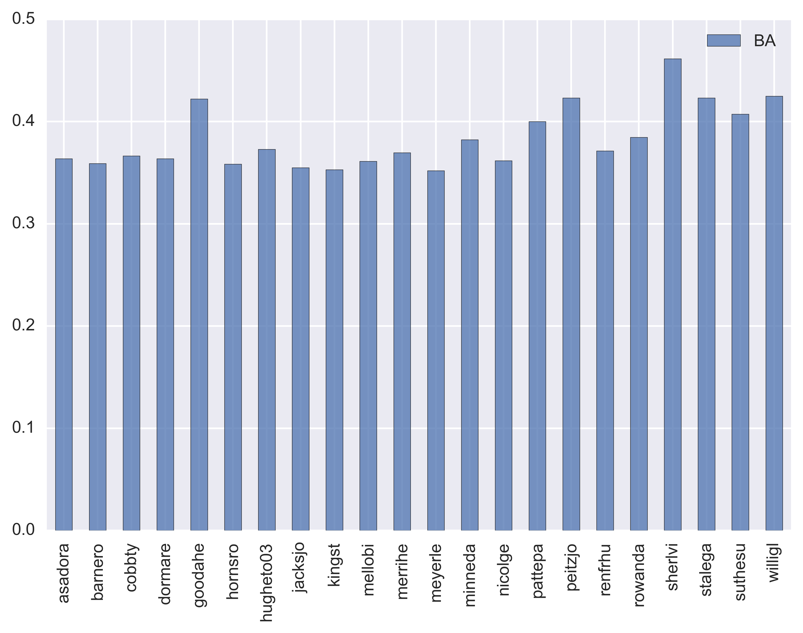
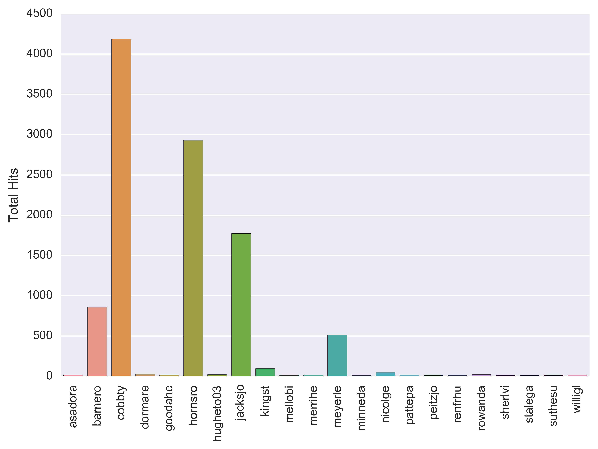
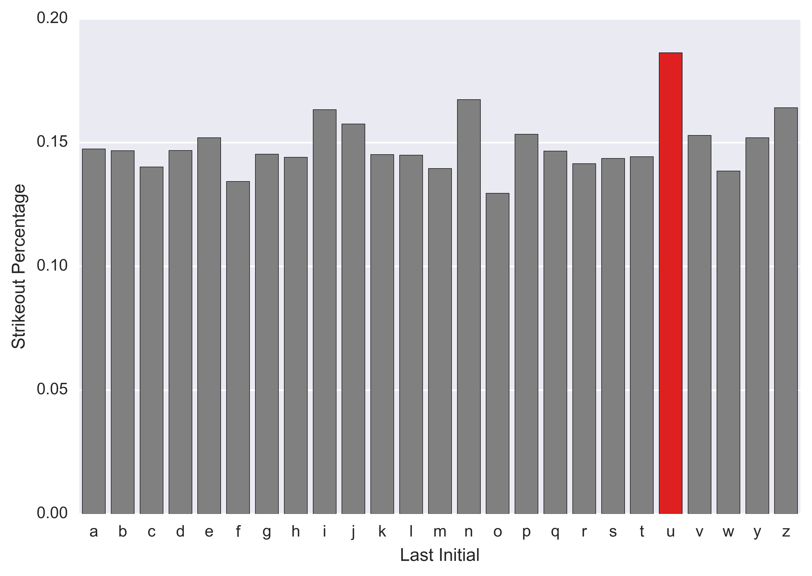

# Data Analysis Final
- Seth Lipkind
- The dataset I chose was the baseball dataset from http://www.seanlahman.com/baseball-archive/statistics/
- This dataset contained all baseball statistics from 1871-2016.  I chose to focus on the Batting.csv and Pitching.csv datasets.  

# Analysis 1
- This analysis involved reading in the Batting.csv file in order to get the batting statistics for all players.  I then grouped the players by team, so that a team batting average could be collected.  The chart below shows the results of the first graph.

- The chart shows that only a few teams collectively had a BA above a .300. I then tried to further analyze the teams that had a batting average above .300, and find out when they played.  The chart below shows the results.

- The chart above shows that only 4 teams had a total BA above .300.  They also only played between 2-7 years in the league, and all played before 1900.  The teams in the 1870's also played less than 150 games, with the 1871 season only having ~30 games.  This makes it much easier to have a higher batting average, as there are less games, so less hits are needed.

# Analysis 2
- For this analysis, I used the Batting.csv file again.  This time, I found who the best hitters in baseball were based on Batting Average.  I then removed the players with less than 10 at bats, because their numbers will be skewed due to the limited at bats.  The chart below shows the results.

- I then found the player from this list who had the most hits, and the result was Ty Cobb, who has over 4000 hits, and still managed to mantain above a .350 batting average.

# Analysis 3
- This analysis was my final analysis with the Batting.csv file.  This time I was trying to seperate players by their last initials, and see who had the highest strike out percentange (Number of Strike outs/Number of At Bats).  Using this analysis, it was found that players who's last name started with U struck out the most, and should probably find a new sport to play.

# Analysis 4
- This analysis was using the Pitching.csv file.  I found that relief pitchers had the best ERA by far.  The top relief pitchers had ERAs under 1.5.  Several pitchers had an ERA of 0.0, but those pitchers did not pitch many innings.

# Analysis 5
- This final analysis was using the pitching.csv file and the goal was to find the pitchers with the most wins.  The analysis stripped any numbers from the playerID in order to ensure the same pitcher was able to be grouped.  I then grouped the pitchers by playerID and summed the wins.  The results are below, with Cy Young having the most wins:

